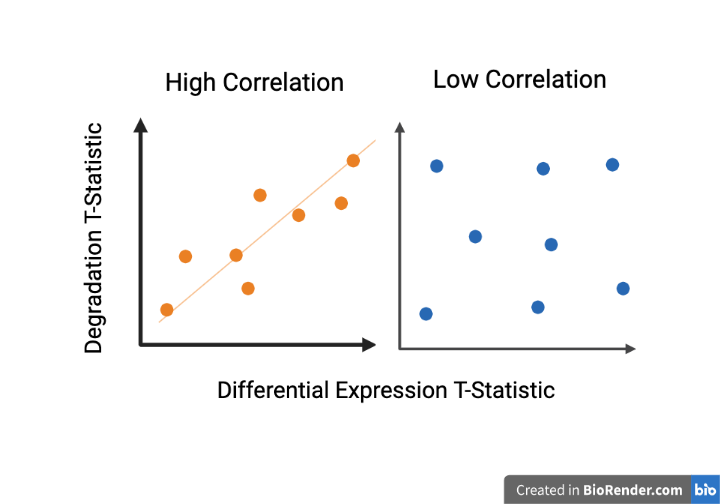
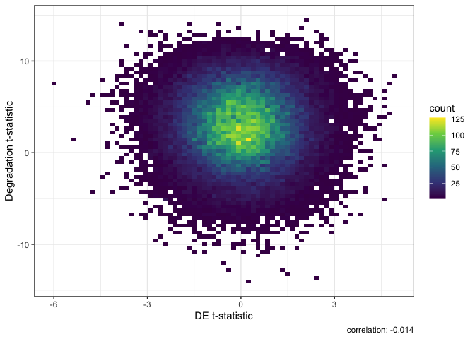
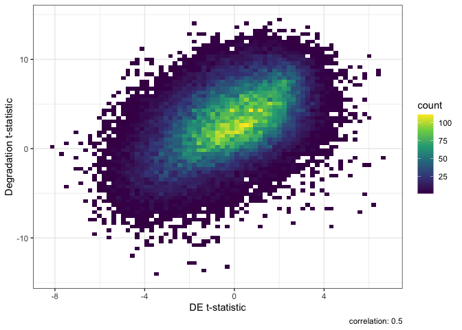

<!-- README.md is generated from README.Rmd. Please edit that file -->

# qsvaR

<!-- badges: start -->
<!-- badges: end -->

Differential expressions analysis requires the ability normalize complex
datasets. In the case of postmortem brain tissue we are tasked with
removing the effects of bench degradation. The qsvaR package combines an
established method for removing the effects of degradation from RNA-seq
data with easy to use functions. The first step in this workflow is to
create an `Ranged Summarized Experiment` object with the transcripts
identified in our qsva experiment. If you already have a
`Ranged Summarized Experiment` of transcripts we can do this with the
getDegTx function as shown below.If not this can be generated with the
`SPEAQeasy` pipeline usinge the `--qsva` flag. This flage requires a
full path to a text file, containing one Ensembl transcript ID per line
for each transcript desired in the final transcripts R output object
(called `rse_tx`). The `sig_transcripts` argument in this package should
contain the same Ensembl transcript IDs as the text file for the
`--qsva` flag.The goal of `qsvaR` is to provide software that can remove
the effects of bench degradation from RNA-seq data.

## Installation Instructions

Get the latest stable R release from CRAN. Then install `qsvaR` using
from Bioconductor the following code:

``` r
if (!requireNamespace("BiocManager", quietly = TRUE)) {
    install.packages("BiocManager")
}

BiocManager::install("qsvaR")
```

And the development version from GitHub with:

``` r
# install.packages("devtools")
devtools::install_github("LieberInstitute/qsvaR")
```

## Example

This is a basic example which shows you how to obtain the quality
surrogate variables (qSVs) for the brainseq phase II dataset. At the
start of this script we will have a `Ranged SummmarizedExperiment` and a
list of all the transcripts found in our degradation study. At the end
we will have a table with differential expression results that is
adjusted for qSVs.

``` r
## R packages we'll use
library("qsvaR")
library("limma")
```

``` r
library("qsvaR")

## We'll download example data from the BrainSeq Phase II project
## described at http://eqtl.brainseq.org/phase2/.
##
## We'll use BiocFileCache to cache these files so you don't have to download
## them again for other examples.
bfc <- BiocFileCache::BiocFileCache()
rse_file <- BiocFileCache::bfcrpath("https://s3.us-east-2.amazonaws.com/libd-brainseq2/rse_tx_unfiltered.Rdata", x = bfc)

## Now that we have the data in our computer, we can load it.
load(rse_file, verbose = TRUE)
#> Loading objects:
#>   rse_tx

## Next we get the degraded transcripts for qSVA
DegTx <- getDegTx(rse_tx)

## Now we can compute the Principal Components (PCs) of the degraded transcripts
pcTx <- getPCs(DegTx, "tpm")

## Using a simple statistical model we determine the number of PCs needed (k)
mod <- model.matrix(~ Dx + Age + Sex + Race + Region,
    data = colData(rse_tx)
)
k <- k_qsvs(DegTx, mod, "tpm")
print(k)
#> [1] 34
```

Now that we have our PCs and the number we need we can generate our
qSVs.

``` r
## Obtain the k qSVs
qsvs <- get_qsvs(pcTx, k)
dim(qsvs)
#> [1] 900  34
```

## Differential Expression

Next we can use a standard `limma` package approach to do differential
expression on the data. The key here is that we add our qSVs to the
statisical model we use through `model.matrix()`. Here we input our
`Ranged SummarizedExperiment` object and our `model.matrix` with qSVs.
The expected output is a sigTx object that shows the results of
differential expression.

``` r
library("limma")

## Add the qSVs to our statistical model
mod_qSVA <- cbind(
    mod,
    qsvs
)

## Extract the transcript expression values and put them in the
## log2(TPM + 1) scale
txExprs <- log2(assays(rse_tx)$tpm + 1)

## Run the standard linear model for differential expression
fitTx <- lmFit(txExprs, mod_qSVA)
eBTx <- eBayes(fitTx)
#> Warning: Zero sample variances detected, have been offset away from zero

## Extract the differential expression results
sigTx <- topTable(eBTx,
    coef = 2,
    p.value = 1, number = nrow(rse_tx)
)
head(sigTx)
#>                         logFC   AveExpr         t      P.Value    adj.P.Val
#> ENST00000553142.5 -0.06547988 2.0390889 -5.999145 2.921045e-09 0.0005786386
#> ENST00000552074.5 -0.12911383 2.4347985 -5.370828 1.009549e-07 0.0099992338
#> ENST00000510632.1  0.08994392 0.9073516  4.920042 1.037016e-06 0.0473143146
#> ENST00000530589.1 -0.10297938 2.4271711 -4.918806 1.043399e-06 0.0473143146
#> ENST00000572236.1 -0.05358333 0.6254025 -4.819980 1.697403e-06 0.0473143146
#> ENST00000450454.6  0.08446871 1.0042440  4.816539 1.726143e-06 0.0473143146
#>                           B
#> ENST00000553142.5 10.200286
#> ENST00000552074.5  6.767821
#> ENST00000510632.1  4.524039
#> ENST00000530589.1  4.518145
#> ENST00000572236.1  4.051142
#> ENST00000450454.6  4.035041
```

Finally, you can compare the resulting t-statistics from your
differential expression model against the degradation time t-statistics
adjusting for the six different brain regions. This type of plot is
called `DEqual` plot and was shown in the initial qSVA framework paper
([Jaffe et al, PNAS, 2017](https://doi.org/10.1073/pnas.1617384114)). We
are really looking for two patterns exemplified here in figure 1. A
direct positive correlation with degradation shown in figure 1 on the
right tells us that there is signal in the data associated with qSVs. An
example of nonconfounded data or data that has been modeled can be seen
in figure 1 on the right with its lack of relationship between the x and
y variables.



``` r
DEqual(sigTx)
```



For comparison, here is the `DEqual()` plot for the model without qSVs.

``` r
DEqual(topTable(eBayes(lmFit(txExprs, mod)), coef = 2, p.value = 1, number = nrow(rse_tx)))
#> Warning: Zero sample variances detected, have been offset away from zero
```


