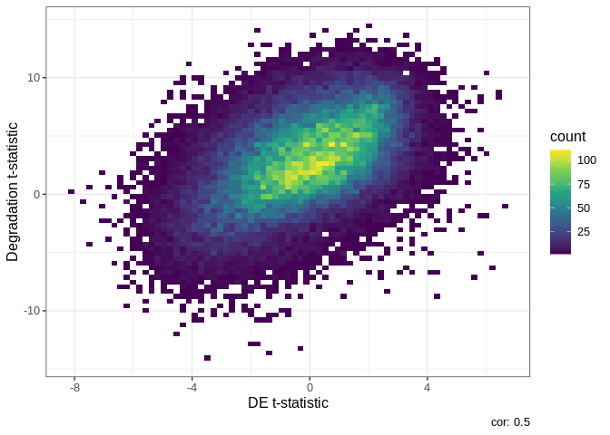

<!-- README.md is generated from README.Rmd. Please edit that file -->

# qsvaR

<!-- badges: start -->

[](https://lifecycle.r-lib.org/articles/stages.html#stable)
[](https://bioconductor.org/checkResults/release/bioc-LATEST/qsvaR)
[](https://github.com/LieberInstitute/qsvaR/actions)
[](https://app.codecov.io/gh/LieberInstitute/qsvaR?branch=main)
[](https://zenodo.org/badge/latestdoi/421556636)
<!-- badges: end -->

Differential expressions analysis requires the ability normalize complex
datasets. In the case of postmortem brain tissue we are tasked with
removing the effects of bench degradation. The qsvaR package combines an
established method for removing the effects of degradation from RNA-seq
data with easy to use functions. The first step in this workflow is to
create an
[`RangedSummarizedExperiment`](https://www.rdocumentation.org/packages/SummarizedExperiment/versions/1.2.3/topics/RangedSummarizedExperiment-class)
object with the transcripts identified in our qSVA experiment. If you
already have a
[`RangedSummarizedExperiment`](https://www.rdocumentation.org/packages/SummarizedExperiment/versions/1.2.3/topics/RangedSummarizedExperiment-class)
of transcripts we can do this with the `getDegTx()` function as shown
below.If not this can be generated with the
[`SPEAQeasy`](http://research.libd.org/SPEAQeasy/index.html) (a RNA-seq
pipeline maintained by our lab) pipeline using the `--qsva` flag. If you
already have a
[`RangedSummarizedExperiment`](https://www.rdocumentation.org/packages/SummarizedExperiment/versions/1.2.3/topics/RangedSummarizedExperiment-class)
object with transcripts then you do not need to run
[`SPEAQeasy`](http://research.libd.org/SPEAQeasy/index.html). This flag
requires a full path to a text file, containing one Ensembl transcript
ID per line for each transcript desired in the final transcripts R
output object (called `rse_tx`). The `sig_transcripts` argument in this
package should contain the same Ensembl transcript IDs as the text file
for the `--qsva` flag.The goal of `qsvaR` is to provide software that
can remove the effects of bench degradation from RNA-seq data.

## Installation Instructions

Get the latest stable R release from CRAN. Then install `qsvaR` using
from Bioconductor the following code:

``` r
if (!requireNamespace("BiocManager", quietly = TRUE)) {
    install.packages("BiocManager")
}

BiocManager::install("qsvaR")
```

And the development version from GitHub with:

``` r
# install.packages("devtools")
devtools::install_github("LieberInstitute/qsvaR")
```

## Example

This is a basic example which shows you how to obtain the quality
surrogate variables (qSVs) for the brainseq [phase II
dataset](http://eqtl.brainseq.org/phase2). qSVs are essentially pricipal
components from an rna-seq experiment designed to model bench
degradation. For more on principal components you can read and
introductory article
[here](https://towardsdatascience.com/tidying-up-with-pca-an-introduction-to-principal-components-analysis-f876599af383#:~:text=The%20goal%20of%20PCA%20is,eliminate%20ones%20that%20do%20not).
At the start of this script we will have a
[`RangedSummarizedExperiment`](https://www.rdocumentation.org/packages/SummarizedExperiment/versions/1.2.3/topics/RangedSummarizedExperiment-class)
and a list of all the transcripts found in our degradation study. At the
end we will have a table with differential expression results that is
adjusted for qSVs.

``` r
## R packages we'll use
library("qsvaR")
library("limma")
```

``` r
library("qsvaR")

## We'll download example data from the BrainSeq Phase II project
## described at http://eqtl.brainseq.org/phase2/.
##
## We'll use BiocFileCache to cache these files so you don't have to download
## them again for other examples.
bfc <- BiocFileCache::BiocFileCache()
rse_file <- BiocFileCache::bfcrpath("https://s3.us-east-2.amazonaws.com/libd-brainseq2/rse_tx_unfiltered.Rdata", x = bfc)

## Now that we have the data in our computer, we can load it.
load(rse_file, verbose = TRUE)
#> Loading objects:
#>   rse_tx
```

In this next step we subset for the transcripts associated with
degradation. These were determined by Joshua M. Stolz et al, 2022. We
have provided three models to choose from. Here the names
“cell\_component”, “top1500”, and “standard” refer to models that were
determined to be effective in removing degradation effects. The
“standard” model involves taking the union of the top 1000 transcripts
associated with degradation from the interaction model and the main
effect model. The “top1500” model is the same as the “standard model
except the union of the top 1500 genes associated with degradation is
selected. The most effective of our models,”cell\_component“, involved
deconvolution of the degradation matrix to determine the proportion of
cell types within our studied tissue.These proportions were then added
to our `model.matrix()` and the union of the top 1000 transcripts in the
interaction model, the main effect model, and the cell proportions model
were used to generate this model of qSVs. In this example we will
choose”cell\_component" use the `getDegTx()` and `select_transcripts()`
functions.

``` r
knitr::include_graphics("./man/figures/transcripts_venn_diagramm.png")
```

<div class="figure">


<p class="caption">
The above venn diagram shows the overlap between transcripts in each of
the previously mentioned models.
</p>

</div>

``` r
## Next we get the degraded transcripts for qSVA from the "cell_component" model
DegTx <- getDegTx(rse_tx, type = "cell_component")

## Now we can compute the Principal Components (PCs) of the degraded transcripts
pcTx <- getPCs(DegTx, "tpm")
```

Next we use the `k_qsvs()` function to calculate how many PCs we will
need to account for the variation. A model matrix accounting for
relevant variables should be used. Common variables such as Age, Sex,
Race and Religion are often included in the model. Again we are using
our `RangedSummarizedExperiment` `DegTx` as the `rse_tx` option. Next we
specify the `mod` with our `model.matrix()`. `model.matrix()` creates a
design (or model) matrix, e.g., by expanding factors to a set of dummy
variables (depending on the contrasts) and expanding interactions
similarly. For more information on creating a design matrix for your
experiment see the documentation
[here](http://bioconductor.org/packages/release/workflows/vignettes/RNAseq123/inst/doc/designmatrices.html).
Again we use the `assayname` option to specify the we are using the
`tpm` assay.

``` r
## Using a simple statistical model we determine the number of PCs needed (k)
mod <- model.matrix(~ Dx + Age + Sex + Race + Region,
    data = colData(rse_tx)
)
k <- k_qsvs(DegTx, mod, "tpm")
print(k)
#> [1] 34
```

Now that we have our PCs and the number we need we can generate our
qSVs.

``` r
## Obtain the k qSVs
qsvs <- get_qsvs(pcTx, k)
dim(qsvs)
#> [1] 900  34
```

This can be done in one step with our wrapper function `qSVA` which just
combinds all the previous mentioned functions.

``` r
qsvs <- qSVA(rse_tx = rse_tx, type = "cell_component", mod = mod, assayname = "tpm")
dim(qsvs)
#> [1] 900  34
```

## Differential Expression

Next we can use a standard `limma` package approach to do differential
expression on the data. The key here is that we add our qSVs to the
statistical model we use through `model.matrix()`. Here we input our
[`Ranged SummarizedExperiment`](https://www.rdocumentation.org/packages/SummarizedExperiment/versions/1.2.3/topics/RangedSummarizedExperiment-class)
object and our `model.matrix` with qSVs. Note here that the
`Ranged SummarizedExperiment` object is the orignal object loaded with
the full list of transcripts, not the the one we subsetted for qSVs.
This is because while PCs can be generated from a subset of genes,
differential expression is best done on the full dataset. The expected
output is a `sigTx` object that shows the results of differential
expression.

``` r
library("limma")

## Add the qSVs to our statistical model
mod_qSVA <- cbind(
    mod,
    qsvs
)

## Extract the transcript expression values and put them in the
## log2(TPM + 1) scale
txExprs <- log2(assays(rse_tx)$tpm + 1)

## Run the standard linear model for differential expression
fitTx <- lmFit(txExprs, mod_qSVA)
eBTx <- eBayes(fitTx)
#> Warning: Zero sample variances detected, have been offset away from zero

## Extract the differential expression results
sigTx <- topTable(eBTx,
    coef = 2,
    p.value = 1, number = nrow(rse_tx)
)
head(sigTx)
#>                         logFC   AveExpr         t      P.Value    adj.P.Val
#> ENST00000553142.5 -0.06547988 2.0390889 -5.999145 2.921045e-09 0.0005786386
#> ENST00000552074.5 -0.12911383 2.4347985 -5.370828 1.009549e-07 0.0099992338
#> ENST00000510632.1  0.08994392 0.9073516  4.920042 1.037016e-06 0.0473143146
#> ENST00000530589.1 -0.10297938 2.4271711 -4.918806 1.043399e-06 0.0473143146
#> ENST00000572236.1 -0.05358333 0.6254025 -4.819980 1.697403e-06 0.0473143146
#> ENST00000450454.6  0.08446871 1.0042440  4.816539 1.726143e-06 0.0473143146
#>                           B
#> ENST00000553142.5 10.200286
#> ENST00000552074.5  6.767821
#> ENST00000510632.1  4.524039
#> ENST00000530589.1  4.518145
#> ENST00000572236.1  4.051142
#> ENST00000450454.6  4.035041
```

Finally, you can compare the resulting t-statistics from your
differential expression model against the degradation time t-statistics
adjusting for the six different brain regions. This type of plot is
called `DEqual` plot and was shown in the initial qSVA framework paper
([Jaffe et al, PNAS, 2017](https://doi.org/10.1073/pnas.1617384114)). We
are really looking for two patterns exemplified here in Figure 1
(cartoon shown earlier). A direct positive correlation with degradation
shown in Figure 1 on the right tells us that there is signal in the data
associated with qSVs. An example of nonconfounded data or data that has
been modeled can be seen in Figure 1 on the right with its lack of
relationship between the x and y variables.


``` r
DEqual(sigTx)
```


For comparison, here is the `DEqual()` plot for the model without qSVs.

``` r
DEqual(topTable(eBayes(lmFit(txExprs, mod)), coef = 2, p.value = 1, number = nrow(rse_tx)))
#> Warning: Zero sample variances detected, have been offset away from zero
```



In these two DEqual plots we can see that the first is much better. With
a correlation of -0.014 we can effectively conclude that we have removed
the effects ofm degradation from the data. In the second plot after
modeling for several common variables we still have a correlation of 0.5
with the degradation experiment. This high correlation shows we still
have a large amount of signal from degradation in our data.
