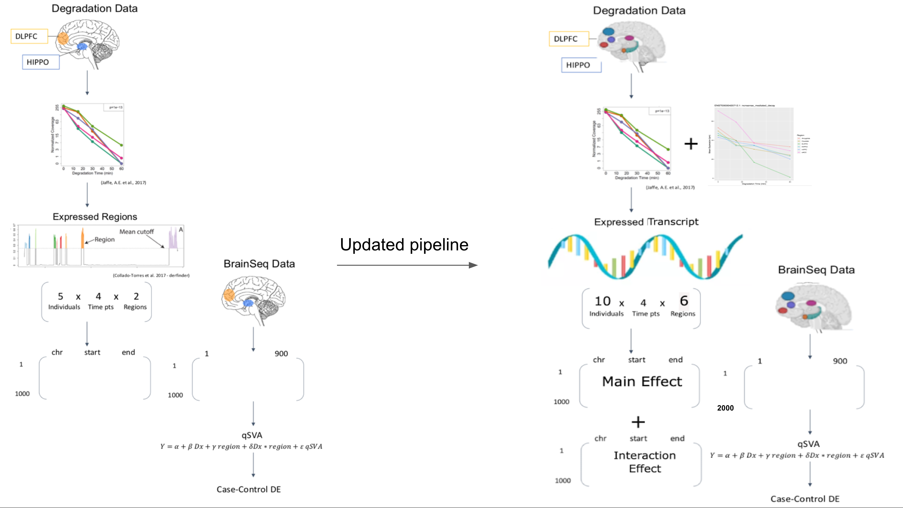

```{r setup, include = FALSE}
knitr::opts_chunk$set(
    collapse = TRUE,
    comment = "#>",
    crop = NULL ## Related to https://stat.ethz.ch/pipermail/bioc-devel/2020-April/016656.html
)
```


```{r vignetteSetup, echo=FALSE, message=FALSE, warning = FALSE}
## Track time spent on making the vignette
startTime <- Sys.time()

## Bib setup
library("RefManageR")

## Write bibliography information
bib <- c(
    R = citation(),
    bsp2 = RefManageR::BibEntry(
        bibtype = "article",
        key = "bsp2",
        author = "Leonardo Collado-Torres and Emily E. Burke and Amy Peterson and JooHeon Shin and Richard E. Straub and Anandita Rajpurohit and Stephen A. Semick and William S. Ulrich and Amanda J. Price and Cristian Valencia and Ran Tao and Amy Deep-Soboslay and Thomas M. Hyde and Joel E. Kleinman and Daniel R. Weinberger and Andrew E. Jaffe",
        title = "Regional Heterogeneity in Gene Expression, Regulation, and Coherence in the Frontal Cortex and Hippocampus across Development and Schizophrenia",
        year = 2019, doi = "0.1016/j.neuron.2019.05.013", journal = "Neuron", month = "jul",
        publisher = "Elsevier BV",
        volume = "103",
        number = "2",
        pages = "203--216.e8",
    ),
    BiocFileCache = citation("BiocFileCache")[1],
    BiocStyle = citation("BiocStyle")[1],
    covr = citation("covr")[1],
    ggplot2 = citation("ggplot2")[1],
    knitr = citation("knitr")[1],
    limma = citation("limma")[1],
    RefManageR = citation("RefManageR")[1],
    rmarkdown = citation("rmarkdown")[1],
    sessioninfo = citation("sessioninfo")[1],
    testthat = citation("testthat")[1],
    qsvaR = citation("qsvaR")[1],
    SummarizedExperiment = citation("SummarizedExperiment")[1],
    sva = citation("sva")[1]
)
```

# Basics

## Install `qsvaR`

`R` is an open-source statistical environment which can be easily modified to enhance its functionality via packages. `r Biocpkg("qsvaR")` is a `R` package available via the [Bioconductor](http://bioconductor.org) repository for packages. `R` can be installed on any operating system from [CRAN](https://cran.r-project.org/) after which you can install `r Biocpkg("qsvaR")` by using the following commands in your `R` session:

```{r "install", eval = FALSE}
## To install Bioconductor packages
if (!requireNamespace("BiocManager", quietly = TRUE)) {
    install.packages("BiocManager")
}

BiocManager::install("qsvaR")

## Check that you have a valid Bioconductor installation
BiocManager::valid()

## You can install the development version from GitHub with:
BiocManager::install("LieberInstitute/qsvaR")
```

## Required knowledge

`r Biocpkg("qsvaR")` is based on many other packages and in particular in those that have implemented the infrastructure needed for dealing with RNA-seq data. That is, packages like `r Biocpkg("SummarizedExperiment")`. Here it might be useful for you to check the qSVA framework manuscript ([Jaffe et al, PNAS, 2017](https://doi.org/10.1073/pnas.1617384114)).

If you are asking yourself the question "Where do I start using Bioconductor?" you might be interested in [this blog post](http://lcolladotor.github.io/2014/10/16/startbioc/#.VkOKbq6rRuU).

## Asking for help

As package developers, we try to explain clearly how to use our packages and in which order to use the functions. But `R` and `Bioconductor` have a steep learning curve so it is critical to learn where to ask for help. The blog post quoted above mentions some but we would like to highlight the [Bioconductor support site](https://support.bioconductor.org/) as the main resource for getting help: remember to use the `qsvaR` tag and check [the older posts](https://support.bioconductor.org/t/qsvaR/). Other alternatives are available such as creating GitHub issues and tweeting. However, please note that if you want to receive help you should adhere to the [posting guidelines](http://www.bioconductor.org/help/support/posting-guide/). It is particularly critical that you provide a small reproducible example and your session information so package developers can track down the source of the error.

## Citing `qsvaR`

We hope that `r Biocpkg("qsvaR")` will be useful for your research. Please use the following information to cite the package and the overall approach. Thank you!

```{r "citation"}
## Citation info
citation("qsvaR")
```

# `qsvaR` Overview

```{r "start", message=FALSE}
library("qsvaR")
library("limma")
library("BiocFileCache")
```

## Significant Transcripts

Differential expressions analysis requires the ability normalize complex datasets. In the case of postmortem brain tissue we are tasked with removing the effects of bench degradation. Our current work expands the scope of qSVA by generating degradation profiles (5 donors across 4 degradation time points: 0, 15, 30, and 60 minutes) from six human brain regions  (n = 20 * 6 = 120): dorsolateral prefrontal cortex (DLPFC), hippocampus (HPC), medial prefrontal cortex (mPFC), subgenual anterior cingulate cortex (sACC), caudate, amygdala (AMY). We identified an average of 80,258 transcripts associated (FDR < 5%) with degradation time across the six brain regions. Testing for an interaction between brain region and degradation time identified 45,712 transcripts (FDR < 5%). A comparison of regions showed a unique pattern of expression changes associated with degradation time particularly in the DLPFC, implying that this region may not be representative of the effects of degradation on gene expression in other tissues. Furthermore previous work was done by analyzing expressed regions ([Collado-Torres et al, NAR, 2017](https://doi.org/10.1093/nar/gkw852)), and while this is an effective method of analysis, expressed regions are not a common output for many pipelines and are computationally expensive to identify, thus creating a barrier for the use of any qSVA software. In our most recent work expression quantification was performed at the transcript level using Salmon ([Patro et al, Nat Methods, 2017](https://doi.org/10.1038/nmeth.4197)). The changes from past work on qSVs to now is illustrated in the below cartoon.


```{r DesignDiagram,fig.cap="The diagram on the right shows the 2016 experimental design for qSVA.The diagram on the right shows the 2022 experimental design for qSVA.", echo=FALSE}

```


The `r Biocpkg("qsvaR")` `r Citep(bib[["qsvaR"]])` package combines an established method for removing the effects of degradation from RNA-seq data with easy to use functions. The first step in this workflow is to create an [`RangedSummarizedExperiment`](https://www.rdocumentation.org/packages/SummarizedExperiment/versions/1.2.3/topics/RangedSummarizedExperiment-class) object with the transcripts identified in our qSVA experiment. If you already have a [`RangedSummarizedExperiment`](https://www.rdocumentation.org/packages/SummarizedExperiment/versions/1.2.3/topics/RangedSummarizedExperiment-class) of transcripts we can do this with the `getDegTx()` function as shown below.If not this can be generated with the `SPEAQeasy` (a RNA-seq pipeline maintained by our lab) pipeline usinge the `--qsva` flag. If you already have a [`RangedSummarizedExperiment`](https://www.rdocumentation.org/packages/SummarizedExperiment/versions/1.2.3/topics/RangedSummarizedExperiment-class) object with transcripts then you do not need to run `SPEAQeasy`. This flag requires a full path to a text file, containing one Ensembl transcript ID per line for each transcript desired in the final transcripts R output object (called `rse_tx`). The `sig_transcripts` argument in this package should contain the same Ensembl transcript IDs as the text file for the `--qsva` flag. The goal of `qsvaR` is to provide software that can remove the effects of bench degradation from RNA-seq data.

```{r "Download demo dataset"}
bfc <- BiocFileCache::BiocFileCache()

## Download brainseq phase 2 ##
rse_file <- BiocFileCache::bfcrpath(
    "https://s3.us-east-2.amazonaws.com/libd-brainseq2/rse_tx_unfiltered.Rdata",
    x = bfc
)
load(rse_file, verbose = TRUE)
## keep only adult samples and apply minimum expression cutoff
rse_tx <- rse_tx[, rse_tx$Age > 17]
rse_tx <- rse_tx[rowMeans(assays(rse_tx)$tpm) > 0.3, ]
```

## Get Degradation Matrix

In this next step we subset for the transcripts associated with degradation. These were determined by Joshua M. Stolz et al, 2022. We have provided three models to choose from. Here the names `"cell_component"`, `"top1500"`, and `"standard"` refer to models that were determined to be effective in removing degradation effects. The `"standard"` model involves taking the union of the top 1000 transcripts associated with degradation from the interaction model and the main effect model. The `"top1500"` model is the same as the `"standard"` model except the union of the top 1500 genes associated with degradation is selected. The most effective of our models, `"cell_component"`, involved deconvolution of the degradation matrix to determine the proportion of cell types within our studied tissue. These proportions were then added to our `model.matrix()` and the union of the top 1000 transcripts in the interaction model, the main effect model, and the cell proportions model were used to generate this model of quality surrogate variables (qSVs). In this example we will choose `"cell_component"` when using the `getDegTx()` and `select_transcripts()` functions.

```{r VennDiagram,fig.cap="The above venn diagram shows the overlap between transcripts in each of the previously mentioned models.", echo=FALSE}
knitr::include_graphics("../man/figures/transcripts_venn_diagramm.png")
```

```{r "Get Degraded Transcripts"}
# obtain transcripts with degradation signature
DegTx <- getDegTx(rse_tx, type = "cell_component")
dim(DegTx)
```

## Generate principal components

The qSVs are derived from taking the principal components (PCs) of the selected transcript expression data. This can be done with the function `getPCs`. qSVs are essentially pricipal components from an rna-seq experiment designed to model bench degradation. For more on principal components you can read and introductory article [`here`](https://towardsdatascience.com/tidying-up-with-pca-an-introduction-to-principal-components-analysis-f876599af383). `rse_tx` specifies a [`RangedSummarizedExperiment`](https://www.rdocumentation.org/packages/SummarizedExperiment/versions/1.2.3/topics/RangedSummarizedExperiment-class) object that has the specified degraded transcripts. For us this is `DegTx`. Here `tpm` is the name of the assay we are using within the [`RangedSummarizedExperiment`](https://www.rdocumentation.org/packages/SummarizedExperiment/versions/1.2.3/topics/RangedSummarizedExperiment-class) object, where TPM stands for _transcripts per million_.

```{r "getPCs demo"}
pcTx <- getPCs(rse_tx = DegTx, assayname = "tpm")
```

## Calculate Number of PCs Needed

Next we use the `k_qsvs()` function to calculate how many PCs we will need to account for the variation. A model matrix accounting for relevant variables should be used. Common variables such as Age, Sex, Race and Religion are often included in the model. Again we are using our `RangedSummarizedExperiment` `DegTx` as the `rse_tx` option. Next we specify the `mod` with our `model.matrix()`. `model.matrix()` creates a design (or model) matrix, e.g., by expanding factors to a set of dummy variables (depending on the contrasts) and expanding interactions similarly. For more information on creating a design matrix for your experiment see the documentation [here](http://bioconductor.org/packages/release/workflows/vignettes/RNAseq123/inst/doc/designmatrices.html). Again we use the `assayname` option to specify that we are using the `tpm` assay.

```{r "k_qsvs demo"}
# design a basic model matrix to model the number of pcs needed
mod <- model.matrix(~ Dx + Age + Sex + Race + Region,
    data = colData(rse_tx)
)

## To ensure that the results are reproducible, you will need to set a
## random seed with the set.seed() function. Internally, we are using
## sva::num.sv() which needs a random seed to ensure reproducibility of the
## results.
set.seed(20230621)

# use k qsvs function to return a integer of pcs needed
k <- k_qsvs(rse_tx = DegTx, mod = mod, assayname = "tpm")
print(k)
```

## Return qSV Matrix

Finally we subset our data to the calculated number of PCs. The output of this function will be the qsvs for each sample. Here we use the `qsvPCs` argument to enter the principal components (`pcTx`). Here the argument k is the number of PCs we are going to include as calculated in the previous step.

```{r "get_qsvs demo"}
# get_qsvs use k to subset our pca analysis
qsvs <- get_qsvs(qsvPCs = pcTx, k = k)
dim(qsvs)
```

This can be done in one step with our wrapper function `qSVA` which just combinds all the previous mentioned functions.

```{r "wrapper function"}
## To ensure that the results are reproducible, you will need to set a
## random seed with the set.seed() function. Internally, we are using
## sva::num.sv() which needs a random seed to ensure reproducibility of the
## results.
set.seed(20230621)

## Example use of the wrapper function qSVA()
qsvs_wrapper <- qSVA(rse_tx = rse_tx, type = "cell_component", mod = mod, assayname = "tpm")
dim(qsvs_wrapper)
```


## Differential Expression

Next we can use a standard limma package approach to do differential expression on the data. The key here is that we add our qsvs to the `model.matrix()`. Here we input our `RangedSummarizedExperiment` object and our `model.matrix()` with qSVs. Note here that the `RangedSummarizedExperiment` object is the original object loaded with the full list of transcripts, not the the one we subsetted for qSVs. This is because while PCs can be generated from a subset of genes, differential expression is best done on the full dataset. The expected output is a `sigTx` object that shows the results of differential expression.

```{r "perform DE"}
# create a model.matrix with demographic info and qsvs
mod_qSVA <- cbind(mod, qsvs)

# log tranform transcript expression
txExprs <- log2(assays(rse_tx)$tpm + 1)

# linear model differential expression
fitTx <- lmFit(txExprs, mod_qSVA)

# generate empirical bayes for DE
eBTx <- eBayes(fitTx)

# get DE results table
sigTx <- topTable(eBTx,
    coef = 2,
    p.value = 1, number = nrow(rse_tx)
)
head(sigTx)
```

If we look at a plot of our most significant transcript we can see that at this level we don't have that much fold change in our data at any individual transcript. These transcripts are however significant and it might be valuable to repeat the analysis at gene level. At gene level the results can be used to do gene ontology enrichment with packages such as `r Biocpkg("clusterProfiler")`.


```{r "DE plot"}
# get expression for most significant gene
yy <- txExprs[rownames(txExprs) == rownames(sigTx)[1], ]

## Visualize the expression of this gene using boxplots
p <- boxplot(yy ~ rse_tx$Dx,
    outline = FALSE,
    ylim = range(yy), ylab = "log2 Exprs", xlab = "",
    main = paste(rownames(sigTx)[1])
)
```   

We can assess the effectiveness of our analysis by first performing DE without qSVs

```{r "perform DE without qSVs"}
# log tranform transcript expression
txExprs_noqsv <- log2(assays(rse_tx)$tpm + 1)

# linear model differential expression with generic model
fitTx_noqsv <- lmFit(txExprs_noqsv, mod)

# generate empirical bayes for DE
eBTx_noqsv <- eBayes(fitTx_noqsv)

# get DE results table
sigTx_noqsv <- topTable(eBTx_noqsv,
    coef = 2,
    p.value = 1, number = nrow(rse_tx)
)

## Explore the top results
head(sigTx_noqsv)
```


Next we should subset our differential expression output to just the t-statistic

```{r "subset to t-statistics"}
## Subset the topTable() results to keep just the t-statistic
DE_noqsv <- data.frame(t = sigTx_noqsv$t, row.names = rownames(sigTx_noqsv))
DE <- data.frame(t = sigTx$t, row.names = rownames(sigTx))

## Explore this data.frame()
head(DE)
```

Using our `DEqual` function we can make a plot comparing the t-statistics from degradation and our differential expression output. In the first model below there is a 0.5 correlation between degradation t-statistics and our differential expression. This means the data is likely confounded for degradation and will lead to many false positives.

```{r "Generate DEqual without qSVs",fig.cap="Result of Differential Expression without qSVA normalization."}
## Generate a DEqual() plot using the model results without qSVs
DEqual(DE_noqsv)
```

In the plot below when we add qSVs to our model we reduce the association with degradation to -0.014, which is very close to 0.

```{r "Generate DEqual with qSVs",fig.cap="Result of Differential Expression with qSVA normalization."}
## Generate a DEqual() plot using the model results with qSVs
DEqual(DE)
```

# Conclusion

We have shown that this method is effective for removing the effects of degradation from RNA-seq data. We found that the `r Biocpkg("qsvaR")` is simpler to use than the previous version from 2016 that used expressed regions instead of transcripts making this software package preferable for users. I would encourage users to read how each set of degradation transcripts was selected as not all models may be appropriate for every experiment. Thank you for your interest and for using `r Biocpkg("qsvaR")` `r Citep(bib[["qsvaR"]])`!

# Acknowledgements

We would like to thank:

* [Heena Divecha](https://twitter.com/HeenaDivecha) for proofreading the documentation of `r Biocpkg("qsvaR")`
* [Louise A. Huuki-Myers](https://twitter.com/lahuuki) for guidance with understanding R code and editing `r Biocpkg("qsvaR")`
* [Nicholas J. Eagles](https://github.com/nick-eagles) for help processing RNA-seq data with [`SPEAQeasy`](https://doi.org/10.1186/s12859-021-04142-3)
* [Aja Hope](https://twitter.com/AjasBlaaahg) for proofreading the documentation of `r Biocpkg("qsvaR")`

# Reproducibility

The `r Biocpkg("qsvaR")` package `r Citep(bib[["qsvaR"]])` was made possible thanks to:

* R `r Citep(bib[["R"]])`
* `r Biocpkg("BiocFileCache")` `r Citep(bib[["BiocFileCache"]])`
* `r Biocpkg("BiocStyle")` `r Citep(bib[["BiocStyle"]])`
* `r CRANpkg("covr")` `r Citep(bib[["covr"]])`
* `r CRANpkg("ggplot2")` `r Citep(bib[["ggplot2"]])`
* `r CRANpkg("knitr")` `r Citep(bib[["knitr"]])`
* `r Biocpkg("limma")` `r Citep(bib[["limma"]])`
* `r CRANpkg("RefManageR")` `r Citep(bib[["RefManageR"]])`
* `r CRANpkg("rmarkdown")` `r Citep(bib[["rmarkdown"]])`
* `r CRANpkg("sessioninfo")` `r Citep(bib[["sessioninfo"]])`
* `r CRANpkg("testthat")` `r Citep(bib[["testthat"]])`
* `r Biocpkg("SummarizedExperiment")` `r Citep(bib[["SummarizedExperiment"]])`
* `r Biocpkg("sva")` `r Citep(bib[["sva"]])`
    

This package was developed using `r BiocStyle::Biocpkg("biocthis")`.


Code for creating the vignette

```{r createVignette, eval=FALSE}
## Create the vignette
library("rmarkdown")
system.time(render("Intro_qsvaR.Rmd", "BiocStyle::html_document"))

## Extract the R code
library("knitr")
knit("Intro_qsvaR.Rmd", tangle = TRUE)
```

Date the vignette was generated.

```{r reproduce1, echo=FALSE}
## Date the vignette was generated
Sys.time()
```

Wallclock time spent generating the vignette.

```{r reproduce2, echo=FALSE}
## Processing time in seconds
totalTime <- diff(c(startTime, Sys.time()))
round(totalTime, digits = 3)
```

`R` session information.

```{r reproduce3, echo=FALSE}
## Session info
library("sessioninfo")
options(width = 120)
session_info()
```


# Bibliography

This vignette was generated using `r Biocpkg("BiocStyle")` `r Citep(bib[["BiocStyle"]])`
with `r CRANpkg("knitr")` `r Citep(bib[["knitr"]])` and `r CRANpkg("rmarkdown")` `r Citep(bib[["rmarkdown"]])` running behind the scenes.

Citations made with `r CRANpkg("RefManageR")` `r Citep(bib[["RefManageR"]])`.

```{r vignetteBiblio, results = "asis", echo = FALSE, warning = FALSE, message = FALSE}
## Print bibliography
PrintBibliography(bib, .opts = list(hyperlink = "to.doc", style = "html"))
```
